# RT
Let’s shift into higher gear! Following up on Rtv1, RT pushes the limits of what Raytracing can do: mirror effect, transparency, object cutting, texture application…Use the preceding project to create an infrastructure capable of supporting all these ramifications and obtain sublime computer-generated images.
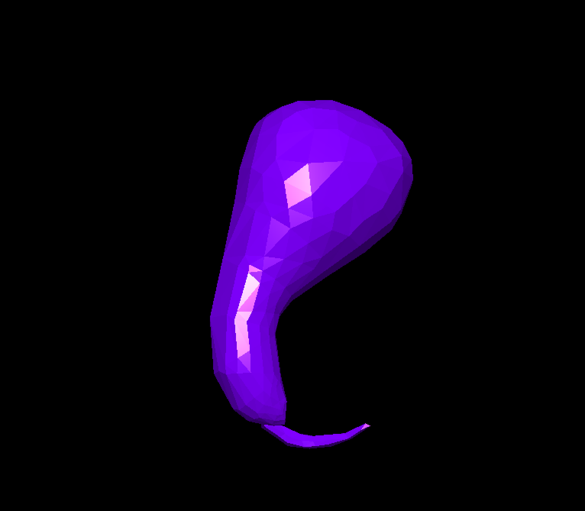
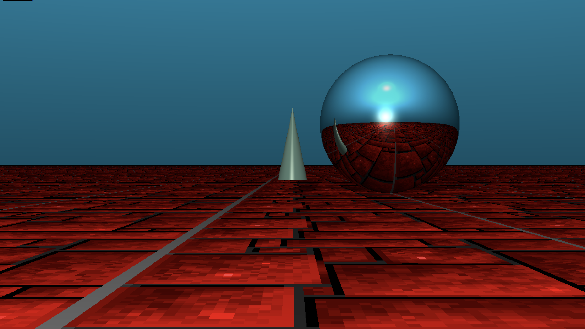
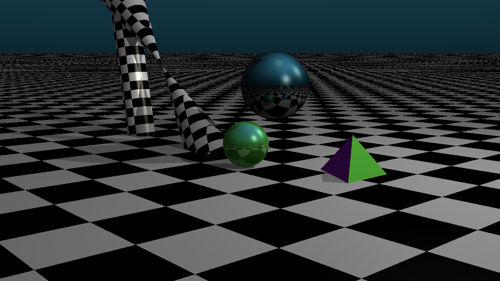
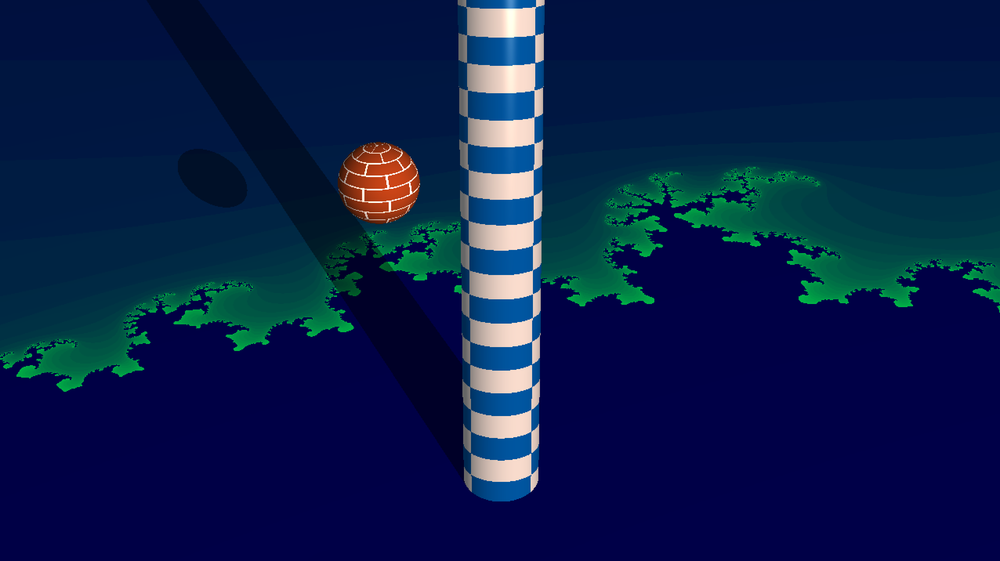
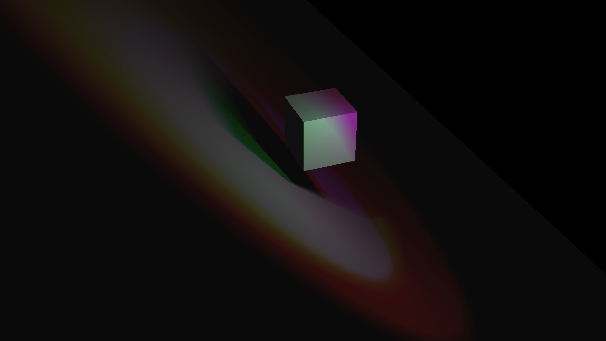
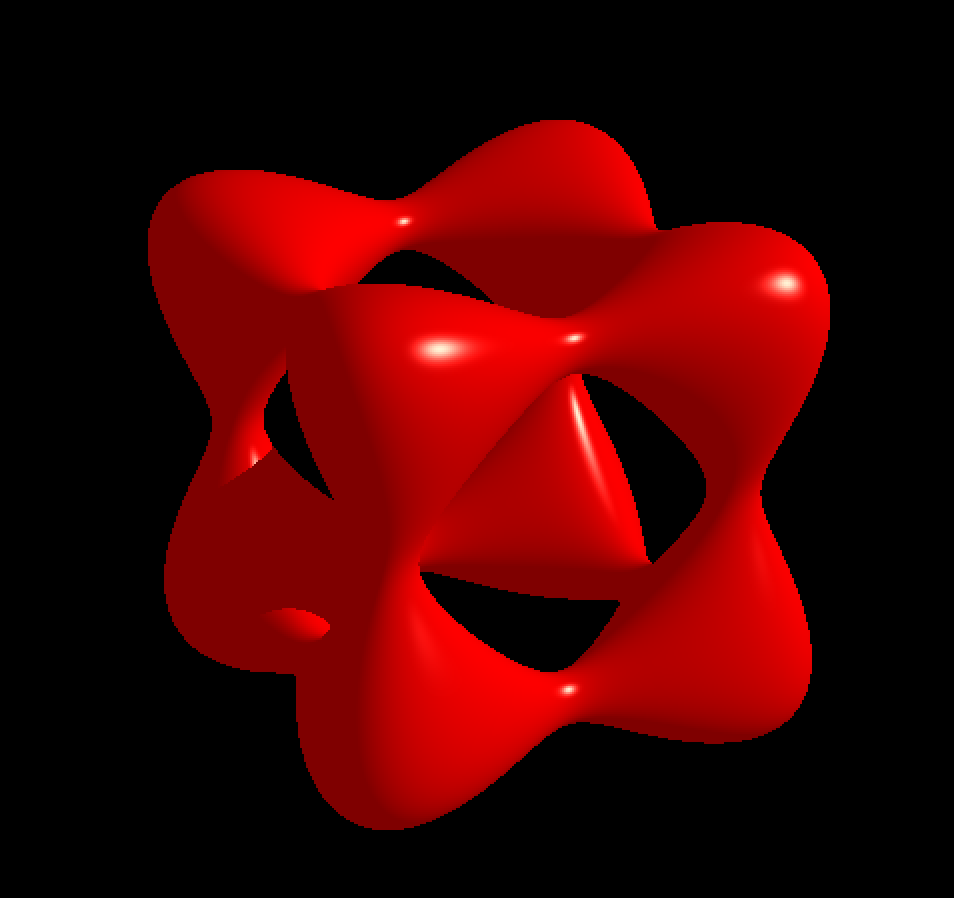
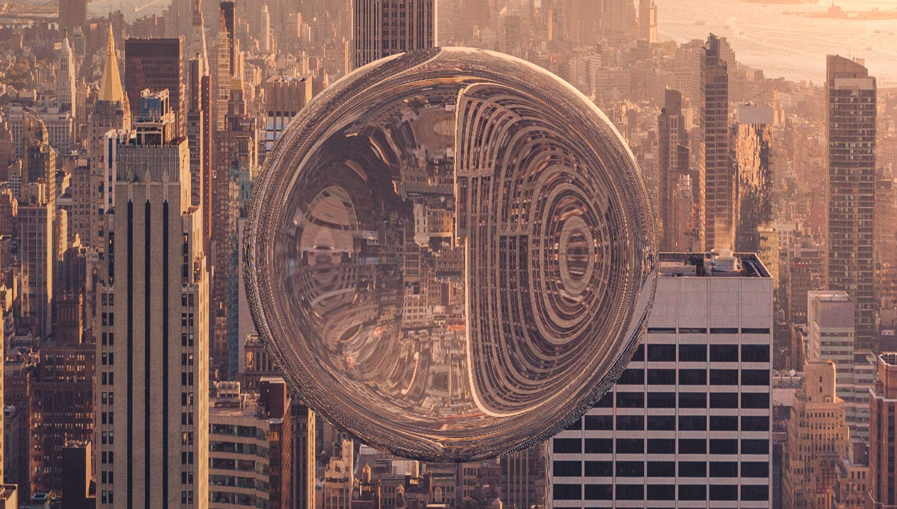

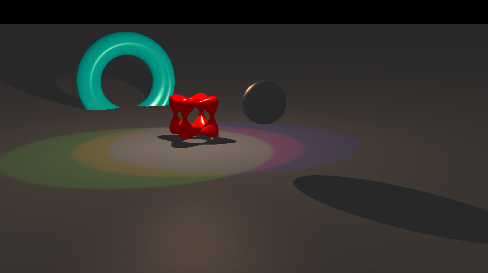
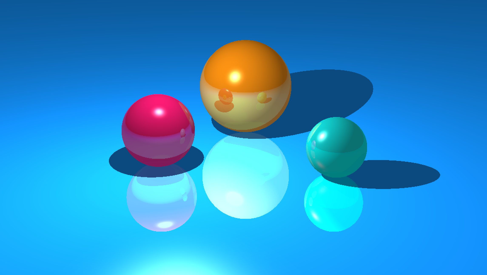
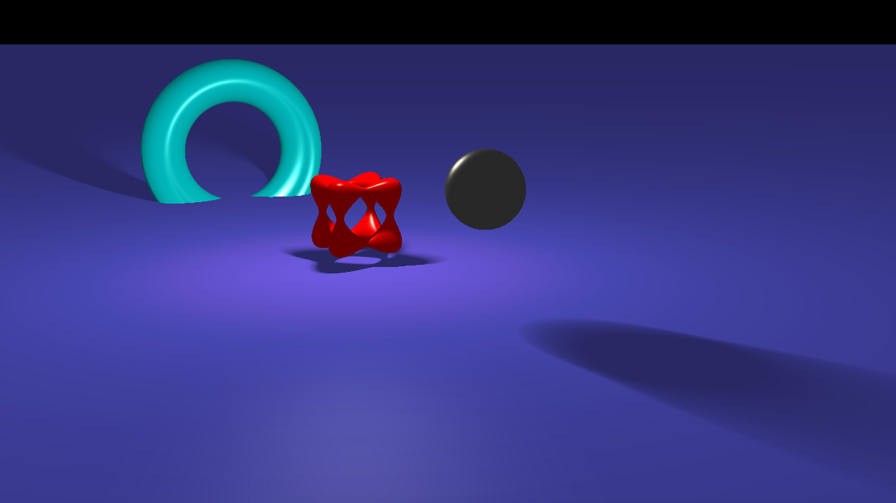
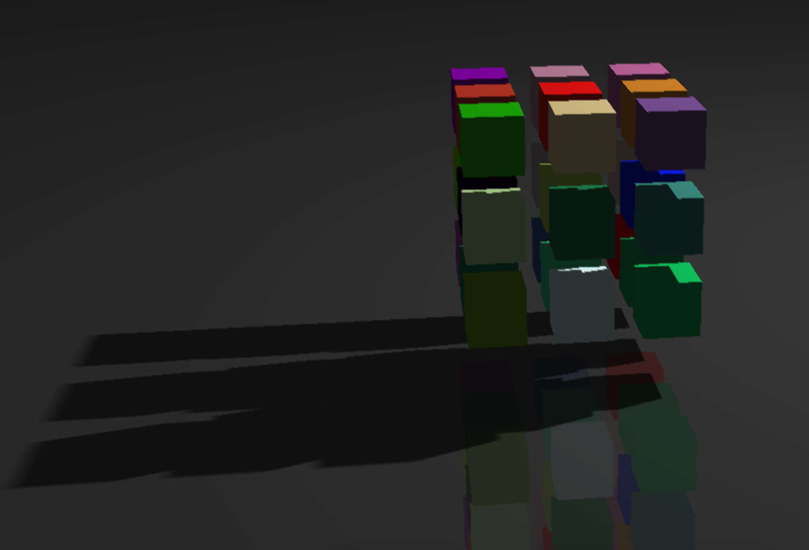

